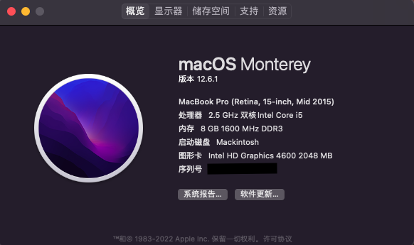
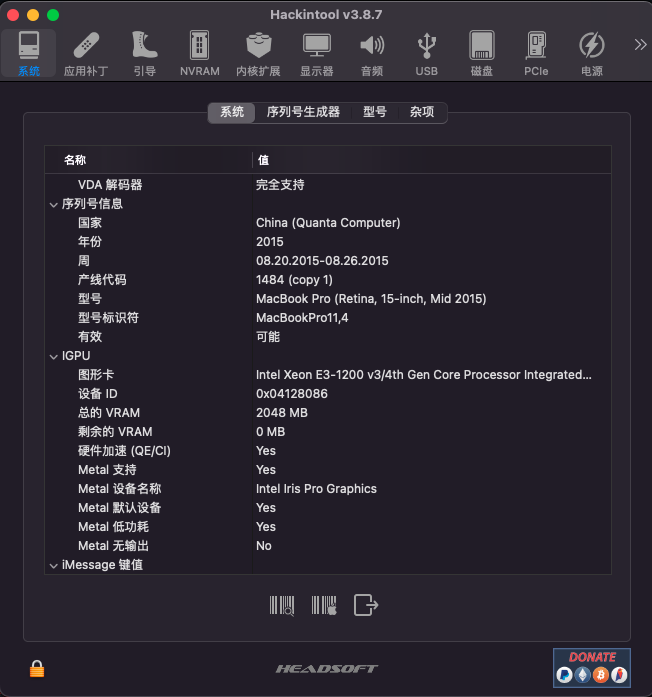
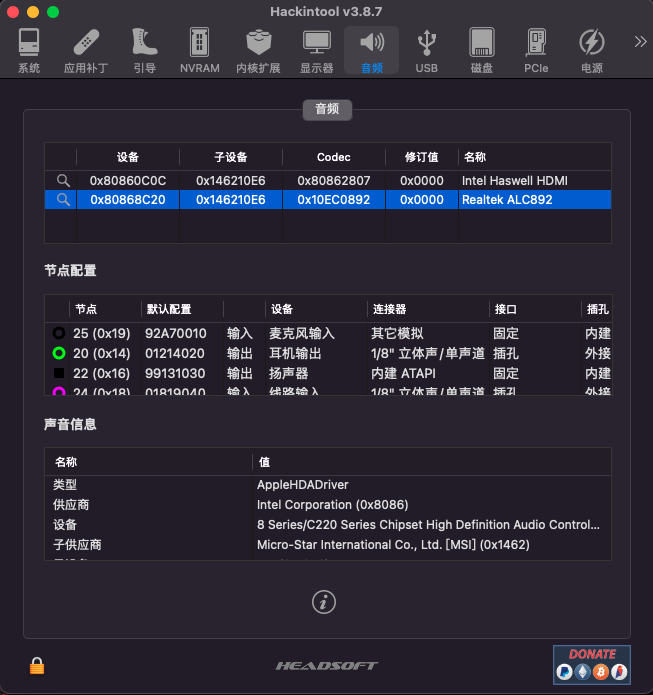
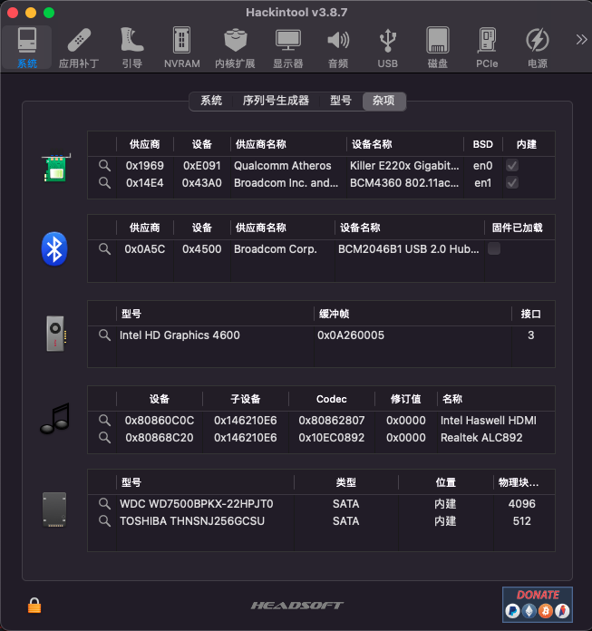
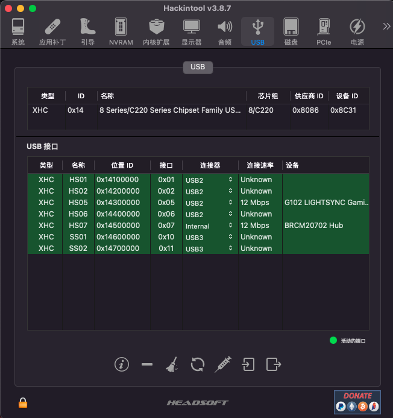
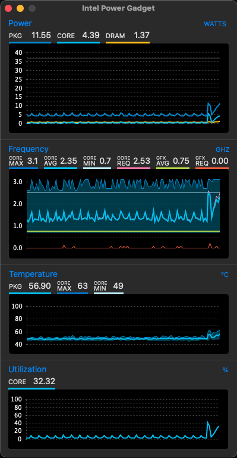

# Hackintosh in MSI GE60 2OE-218XCN
## 1. 此电脑配置：
|   组件   | 名称                                                                |
| -------- |---------------------------------------------------------------------|
| 电脑型号 | 微星 GE60 2OC\2OD\2OE 笔记本电脑                                    |
|   系统   | macOS Monterey 版本12.6.1（版号21G217）                             |
|  处理器  | Intel(R) Core(TM) i5-4200M CPU @ 2.50GHz                            |
|   主板   | Intel Lynx Point HM87, Intel Haswell                                |
|   显卡   | Intel HD Graphics 4600 / nVIDIA GeForce GTX 765M（无解，需屏蔽独显）|
|   内存   | 8 GB ( 金士顿 DDR3L 1600MHz )                                       |
|  主硬盘  | 东芝 THNSNJ256GCSU ( 256 GB / 固态硬盘 )                            |
|  显示器  | LG LGD0259 ( 15.7 英寸  )                                           |
|   声卡   | 瑞昱 ALC892 @ 英特尔 Lynx Point  高保真音频                         |
| 有线网卡 | 鈺硕 Killer E2200 Gigabit Ethernet Controller / 微星                |
| 无线网卡 | BCM94360CS2                                                         |

## 2. 已经完成的
- 显卡完美驱动：核心显卡HD4600注入仿冒ID，完美驱动，独立显卡已通过修补dsdt屏蔽；
- 音频完美驱动：通过定制applealc驱动，注入layout-id，解决睡眠后无声的问题；
- 网卡完美驱动：支持handoff、airdrop；
- USB完美驱动：定制USB，所有接口可用；
- 睡眠完美；
- 电池显示；
- 键盘、鼠标、触摸板识别，可用；
### 需要注意的是 
- 使用前请自行修改设备序列号：root > PlatformInfo > System Serial Number
- 安装前请先清除NVRAM：clearnvram 

## 3. 未完成的
- 目前已经趋近完美黑苹果，若有不足之处，望指出，谢谢。
## 4. 待完善
- 只是闲着无聊拿出旧本子来玩玩，有什么问题后续会继续更新，未完待续。。。
## 5. 系统概况
### macOS Monterey 12.6.1

### Graphics

### Audio

### Wifi and bluetooth

### USB

### Intel Power Gadget

